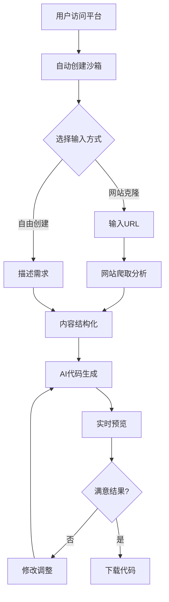
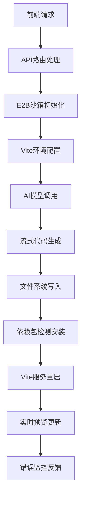
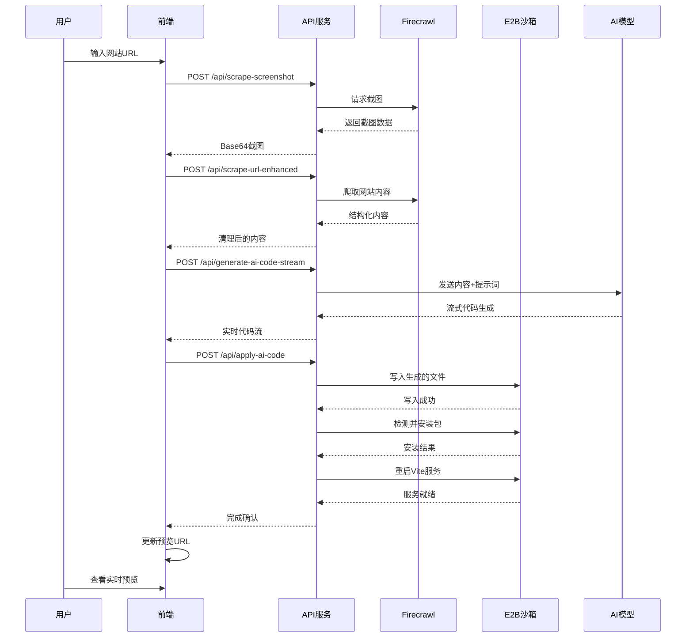
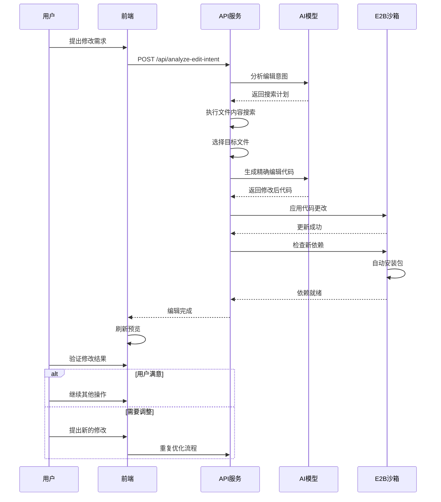
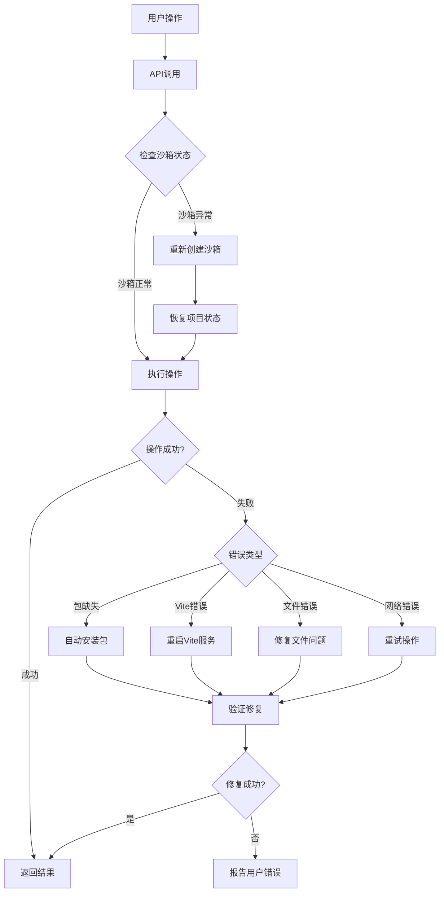

# Open Lovable - 工作流程指南

## 概述

Open Lovable 通过智能化的工作流程，将复杂的 React 应用开发简化为自然语言对话。本指南详细介绍了从网站爬取到应用部署的完整工作流程，帮助开发者和用户充分利用平台的强大功能。

## 核心工作流程

### 1. 用户交互流程



### 2. 技术处理流程



## 详细工作流程分析

### 阶段一：环境初始化

#### 1.1 沙箱自动创建

用户访问平台时，系统会自动执行以下初始化流程：

**前端触发**
```typescript
useEffect(() => {
  const initializePage = async () => {
    // 清理旧的对话数据
    await fetch('/api/conversation-state', {
      method: 'POST',
      body: JSON.stringify({ action: 'clear-old' })
    });
    
    // 检查URL参数中的沙箱ID
    const sandboxIdParam = searchParams.get('sandbox');
    
    if (sandboxIdParam) {
      // 尝试恢复现有沙箱
      await createSandbox(true);
    } else {
      // 创建新沙箱
      await createSandbox(true);
    }
  };
  
  initializePage();
}, []);
```

**后端处理流程**
1. **沙箱创建** (`POST /api/create-ai-sandbox`)
   - 销毁现有沙箱（如果存在）
   - 创建新的 E2B 容器
   - 配置 15 分钟超时机制

2. **环境配置**
   - 初始化 Node.js 环境
   - 创建 React + Vite 项目结构
   - 配置 Tailwind CSS
   - 安装基础依赖包

3. **开发服务器启动**
   - 启动 Vite 开发服务器（端口 5173）
   - 配置热重载和错误监控
   - 生成预览 URL

#### 1.2 状态同步

```typescript
// 全局状态初始化
global.sandboxState = {
  fileCache: {
    files: {},
    lastSync: Date.now(),
    sandboxId
  },
  sandbox,
  sandboxData: {
    sandboxId,
    url: `https://${host}`
  }
};

// 文件跟踪初始化
global.existingFiles = new Set([
  'src/App.jsx',
  'src/main.jsx', 
  'src/index.css',
  'index.html',
  'package.json'
]);
```

### 阶段二：内容输入与分析

#### 2.1 网站克隆模式

**用户输入URL**
```typescript
const handleUrlScrape = async (url: string) => {
  setIsCapturingScreenshot(true);
  
  // 1. 捕获网站截图
  const screenshotResponse = await fetch('/api/scrape-screenshot', {
    method: 'POST',
    body: JSON.stringify({ url })
  });
  
  // 2. 爬取网站内容
  const scrapeResponse = await fetch('/api/scrape-url-enhanced', {
    method: 'POST', 
    body: JSON.stringify({ url })
  });
  
  const data = await scrapeResponse.json();
  
  // 3. 更新对话上下文
  setConversationContext(prev => ({
    ...prev,
    scrapedWebsites: [...prev.scrapedWebsites, {
      url,
      content: data,
      timestamp: new Date()
    }]
  }));
};
```

**后端处理** (`POST /api/scrape-url-enhanced`)
1. **Firecrawl API 调用**
   ```typescript
   const firecrawlResponse = await fetch('https://api.firecrawl.dev/v1/scrape', {
     method: 'POST',
     headers: {
       'Authorization': `Bearer ${FIRECRAWL_API_KEY}`,
       'Content-Type': 'application/json'
     },
     body: JSON.stringify({
       url,
       formats: ['markdown', 'html'],
       waitFor: 3000,
       timeout: 30000,
       blockAds: true,
       maxAge: 3600000  // 1小时缓存
     })
   });
   ```

2. **内容清理与结构化**
   ```typescript
   // 智能引号处理
   const sanitizeQuotes = (text: string) => text
     .replace(/[\u2018\u2019\u201A\u201B]/g, "'")    // 智能单引号
     .replace(/[\u201C\u201D\u201E\u201F]/g, '"')    // 智能双引号
     .replace(/[\u2013\u2014]/g, '-')                 // 破折号
     .replace(/[\u2026]/g, '...')                     // 省略号
     .replace(/[\u00A0]/g, ' ');                      // 非断行空格
   
   // 结构化数据提取
   const structured = {
     title: sanitizeQuotes(title),
     description: sanitizeQuotes(description), 
     content: sanitizedMarkdown,
     url
   };
   ```

#### 2.2 自由创建模式

用户直接描述需求，系统通过上下文理解进行处理：

```typescript
const handleFreeformInput = async (prompt: string) => {
  // 添加用户消息到对话历史
  addChatMessage(prompt, 'user');
  
  // 触发AI代码生成
  await streamAIResponse(prompt);
};
```

### 阶段三：AI 代码生成

#### 3.1 智能编辑意图分析

当用户请求修改现有代码时，系统首先分析编辑意图：

**意图分析** (`POST /api/analyze-edit-intent`)
```typescript
const searchPlanSchema = z.object({
  editType: z.enum([
    'UPDATE_COMPONENT',
    'ADD_FEATURE',
    'FIX_ISSUE', 
    'UPDATE_STYLE',
    'REFACTOR',
    'ADD_DEPENDENCY',
    'REMOVE_ELEMENT'
  ]),
  reasoning: z.string(),
  searchTerms: z.array(z.string()),
  regexPatterns: z.array(z.string()).optional(),
  expectedMatches: z.number().min(1).max(10).default(1)
});
```

**搜索执行流程**
1. **文件内容搜索**
   - 基于搜索词进行文件内容匹配
   - 使用正则表达式进行结构化搜索
   - 计算匹配度和置信度

2. **目标文件选择**
   - 根据搜索结果选择最佳匹配文件
   - 确定具体的代码位置（行号）
   - 生成精确的编辑上下文

#### 3.2 流式代码生成

**前端流处理**
```typescript
const streamAIResponse = async (prompt: string) => {
  const response = await fetch('/api/generate-ai-code-stream', {
    method: 'POST',
    body: JSON.stringify({
      prompt,
      model: aiModel,
      context: {
        sandboxId: sandboxData?.sandboxId,
        currentFiles: sandboxFiles,
        conversationContext
      },
      isEdit: true
    })
  });
  
  const reader = response.body?.getReader();
  const decoder = new TextDecoder();
  
  while (true) {
    const { done, value } = await reader.read();
    if (done) break;
    
    const chunk = decoder.decode(value);
    const lines = chunk.split('\n');
    
    for (const line of lines) {
      if (line.startsWith('data: ')) {
        const data = JSON.parse(line.slice(6));
        handleStreamData(data);
      }
    }
  }
};
```

**流数据处理**
```typescript
const handleStreamData = (data: any) => {
  switch (data.type) {
    case 'status':
      setGenerationProgress(prev => ({ 
        ...prev, 
        status: data.message 
      }));
      break;
      
    case 'stream':
      setGenerationProgress(prev => ({
        ...prev,
        streamedCode: prev.streamedCode + data.text,
        isStreaming: true
      }));
      break;
      
    case 'component':
      setGenerationProgress(prev => ({
        ...prev,
        components: [...prev.components, {
          name: data.name,
          path: data.path, 
          completed: true
        }]
      }));
      break;
      
    case 'package':
      // 检测到新包依赖
      handlePackageDetection(data.name);
      break;
      
    case 'complete':
      setGenerationProgress(prev => ({ 
        ...prev, 
        isGenerating: false 
      }));
      applyGeneratedCode(data.generatedCode);
      break;
  }
};
```

#### 3.3 上下文感知生成

AI 系统会考虑以下上下文信息：

**对话历史**
```typescript
// 构建对话上下文
let conversationContext = '';
if (global.conversationState?.context.messages.length > 1) {
  // 最近的编辑记录
  const recentEdits = global.conversationState.context.edits.slice(-3);
  conversationContext += `\n### Recent Edits:\n`;
  recentEdits.forEach(edit => {
    conversationContext += `- "${edit.userRequest}" → ${edit.editType}\n`;
  });
  
  // 最近创建的文件
  const recentlyCreatedFiles = [];
  const recentMsgs = global.conversationState.context.messages.slice(-5);
  recentMsgs.forEach(msg => {
    if (msg.metadata?.editedFiles) {
      recentlyCreatedFiles.push(...msg.metadata.editedFiles);
    }
  });
  
  // 防重复创建警告
  if (recentlyCreatedFiles.length > 0) {
    conversationContext += `\n### 🚨 RECENTLY CREATED FILES:\n`;
    recentlyCreatedFiles.forEach(file => {
      conversationContext += `- ${file}\n`;
    });
  }
}
```

**项目文件结构**
```typescript
// 文件清单构建
const manifest: FileManifest = {
  files: {},           // 文件内容映射
  routes: [],          // 路由信息  
  componentTree: {},   // 组件依赖树
  entryPoint: '',      // 应用入口
  styleFiles: [],      // 样式文件
  timestamp: Date.now()
};

// 组件关系分析
const componentTree = buildComponentTree(manifest.files);
```

### 阶段四：代码应用与部署

#### 4.1 代码解析与应用

**代码解析** (`POST /api/apply-ai-code`)
```typescript
function parseAIResponse(response: string): ParsedResponse {
  const sections = {
    files: [],
    commands: [],
    packages: [],
    structure: null,
    explanation: ''
  };

  // 解析文件部分
  const fileRegex = /<file path="([^"]+)">([\s\S]*?)(?:<\/file>|$)/g;
  let match;
  while ((match = fileRegex.exec(response)) !== null) {
    const filePath = match[1];
    const content = match[2].trim();
    
    sections.files.push({ path: filePath, content });
  }
  
  // 解析包依赖
  const pkgRegex = /<package>(.*?)<\/package>/g;
  while ((match = pkgRegex.exec(response)) !== null) {
    sections.packages.push(match[1].trim());
  }
  
  return sections;
}
```

**文件写入流程**
```typescript
// 使用 E2B 文件 API 写入
for (const file of filteredFiles) {
  try {
    let normalizedPath = file.path;
    
    // 路径规范化
    if (!normalizedPath.startsWith('src/') && 
        !normalizedPath.startsWith('public/') && 
        normalizedPath !== 'index.html') {
      normalizedPath = 'src/' + normalizedPath;
    }
    
    const fullPath = `/home/user/app/${normalizedPath}`;
    
    // 清理 CSS 导入（使用 Tailwind）
    let fileContent = file.content;
    if (file.path.endsWith('.jsx') || file.path.endsWith('.js')) {
      fileContent = fileContent.replace(/import\s+['"]\.\/[^'"]+\.css['"];?\s*\n?/g, '');
    }
    
    // 写入文件
    await global.activeSandbox.files.write(fullPath, fileContent);
    
    // 更新缓存
    if (global.sandboxState?.fileCache) {
      global.sandboxState.fileCache.files[normalizedPath] = {
        content: fileContent,
        lastModified: Date.now()
      };
    }
    
    results.filesCreated.push(normalizedPath);
    global.existingFiles.add(normalizedPath);
    
  } catch (error) {
    results.errors.push(`Failed to create ${file.path}: ${error.message}`);
  }
}
```

#### 4.2 包管理自动化

**智能包检测**
```typescript
// 从代码中提取导入
const extractPackagesFromCode = (content: string) => {
  const packages = [];
  const importRegex = /import\s+(?:(?:\{[^}]*\}|\*\s+as\s+\w+|\w+)(?:\s*,\s*(?:\{[^}]*\}|\*\s+as\s+\w+|\w+))*\s+from\s+)?['"]([^'"]+)['"]/g;
  
  let importMatch;
  while ((importMatch = importRegex.exec(content)) !== null) {
    const importPath = importMatch[1];
    
    // 跳过相对导入和内置模块
    if (!importPath.startsWith('.') && 
        !importPath.startsWith('/') && 
        importPath !== 'react' && 
        importPath !== 'react-dom') {
      
      // 处理作用域包
      const packageName = importPath.startsWith('@') 
        ? importPath.split('/').slice(0, 2).join('/')
        : importPath.split('/')[0];
      
      if (!packages.includes(packageName)) {
        packages.push(packageName);
      }
    }
  }
  
  return packages;
};
```

**自动安装流程** (`POST /api/detect-and-install-packages`)
```typescript
// 1. 检查已安装包
const checkResult = await global.activeSandbox.runCode(`
import os
import json

installed = []
missing = []
packages = ${JSON.stringify(uniquePackages)}

for package in packages:
    package_path = f"/home/user/app/node_modules/{package}"
    if os.path.exists(package_path):
        installed.append(package)
    else:
        missing.append(package)

print(json.dumps({"installed": installed, "missing": missing}))
`);

// 2. 安装缺失包
if (status.missing.length > 0) {
  const installResult = await global.activeSandbox.runCode(`
import subprocess
import os

packages_to_install = ${JSON.stringify(status.missing)}
result = subprocess.run(['npm', 'install', '--save'] + packages_to_install, 
                       capture_output=True, 
                       text=True, 
                       cwd='/home/user/app',
                       timeout=60)

# 验证安装结果
installed = []
failed = []
for package in packages_to_install:
    package_path = f"/home/user/app/node_modules/{package}"
    if os.path.exists(package_path):
        installed.append(package)
    else:
        failed.append(package)
  `);
}
```

#### 4.3 Vite 服务管理

**自动重启机制** (`POST /api/restart-vite`)
```typescript
const result = await global.activeSandbox.runCode(`
import subprocess
import os
import signal
import time

# 杀死现有进程
try:
    with open('/tmp/vite-process.pid', 'r') as f:
        pid = int(f.read().strip())
        os.kill(pid, signal.SIGTERM)
        time.sleep(1)
except:
    pass

os.chdir('/home/user/app')

# 清理错误文件
with open('/tmp/vite-errors.json', 'w') as f:
    json.dump({"errors": [], "lastChecked": time.time()}, f)

# 启动新进程
process = subprocess.Popen(
    ['npm', 'run', 'dev'],
    stdout=subprocess.PIPE,
    stderr=subprocess.PIPE,
    text=True
)

# 保存进程ID
with open('/tmp/vite-process.pid', 'w') as f:
    f.write(str(process.pid))
`);
```

**错误监控** (`GET /api/monitor-vite-logs`)
```typescript
// 实时错误检测
const errorDetection = `
import json
import re

errors = []

# 检查错误文件
try:
    with open('/tmp/vite-errors.json', 'r') as f:
        data = json.load(f)
        errors.extend(data.get('errors', []))
except:
    pass

# 扫描日志文件中的导入错误
import_errors = re.findall(r'Failed to resolve import "([^"]+)"', log_content)
for pkg in import_errors:
    if not pkg.startswith('.'):
        final_pkg = pkg.split('/')[0] if not pkg.startswith('@') else '/'.join(pkg.split('/')[:2])
        
        error_obj = {
            "type": "npm-missing",
            "package": final_pkg,
            "message": f"Failed to resolve import \\"{pkg}\\"",
            "timestamp": time.time()
        }
        
        if not any(e['package'] == error_obj['package'] for e in errors):
            errors.append(error_obj)
`;
```

### 阶段五：实时预览与调试

#### 5.1 iframe 预览集成

**预览组件**
```typescript
export default function SandboxPreview({ sandboxId, port, type, output, isLoading }) {
  const [previewUrl, setPreviewUrl] = useState('');
  const [iframeKey, setIframeKey] = useState(0);

  useEffect(() => {
    if (sandboxId && type !== 'console') {
      setPreviewUrl(`https://${sandboxId}-${port}.e2b.dev`);
    }
  }, [sandboxId, port, type]);

  const handleRefresh = () => {
    setIframeKey(prev => prev + 1);  // 强制刷新 iframe
  };

  return (
    <div className="space-y-4">
      {/* 控制栏 */}
      <div className="flex items-center justify-between">
        <span className="text-sm text-gray-400">
          {type === 'vite' ? '⚡ Vite' : '▲ Next.js'} Preview
        </span>
        <div className="flex items-center gap-2">
          <button onClick={handleRefresh}>
            <RefreshCw className="w-4 h-4" />
          </button>
          <a href={previewUrl} target="_blank">
            <ExternalLink className="w-4 h-4" />
          </a>
        </div>
      </div>

      {/* 预览 iframe */}
      <iframe
        key={iframeKey}
        src={previewUrl}
        className="w-full h-[600px] bg-white"
        sandbox="allow-scripts allow-same-origin allow-forms"
      />
    </div>
  );
}
```

#### 5.2 错误检测与处理

**HMR 错误监控**
```typescript
export default function HMRErrorDetector({ iframeRef, onErrorDetected }) {
  useEffect(() => {
    const checkForHMRErrors = () => {
      if (!iframeRef.current) return;

      try {
        const iframeDoc = iframeRef.current.contentDocument;
        
        // 检查 Vite 错误覆盖层
        const errorOverlay = iframeDoc.querySelector('vite-error-overlay');
        if (errorOverlay) {
          const messageElement = errorOverlay.shadowRoot?.querySelector('.message-body');
          if (messageElement) {
            const errorText = messageElement.textContent || '';
            
            // 解析导入错误
            const importMatch = errorText.match(/Failed to resolve import "([^"]+)"/);
            if (importMatch) {
              const packageName = importMatch[1];
              if (!packageName.startsWith('.')) {
                // 提取基础包名
                let finalPackage = packageName;
                if (packageName.startsWith('@')) {
                  const parts = packageName.split('/');
                  finalPackage = parts.length >= 2 ? parts.slice(0, 2).join('/') : packageName;
                } else {
                  finalPackage = packageName.split('/')[0];
                }

                onErrorDetected([{
                  type: 'npm-missing',
                  message: `Failed to resolve import "${packageName}"`,
                  package: finalPackage
                }]);
              }
            }
          }
        }
      } catch (error) {
        // 跨域错误是预期的
      }
    };

    // 每 2 秒检查一次
    const interval = setInterval(checkForHMRErrors, 2000);
    return () => clearInterval(interval);
  }, [iframeRef, onErrorDetected]);

  return null;
}
```

### 阶段六：用户反馈与优化

#### 6.1 聊天界面管理

**消息处理系统**
```typescript
const addChatMessage = (content: string, type: ChatMessage['type'], metadata?: ChatMessage['metadata']) => {
  setChatMessages(prev => {
    // 避免重复的连续系统消息
    if (type === 'system' && prev.length > 0) {
      const lastMessage = prev[prev.length - 1];
      if (lastMessage.type === 'system' && lastMessage.content === content) {
        return prev;
      }
    }
    
    return [...prev, { 
      content, 
      type, 
      timestamp: new Date(), 
      metadata 
    }];
  });
};

// 自动滚动到底部
useEffect(() => {
  if (chatMessagesRef.current) {
    chatMessagesRef.current.scrollTop = chatMessagesRef.current.scrollHeight;
  }
}, [chatMessages]);
```

**进度指示器**
```typescript
export default function CodeApplicationProgress({ state }) {
  if (!state.stage || state.stage === 'complete') return null;

  return (
    <AnimatePresence mode="wait">
      <motion.div
        key="loading"
        initial={{ opacity: 0, y: 10 }}
        animate={{ opacity: 1, y: 0 }}
        exit={{ opacity: 0, y: -10 }}
        transition={{ duration: 0.3 }}
      >
        <div className="flex items-center gap-3">
          <motion.div
            animate={{ rotate: 360 }}
            transition={{ duration: 1, repeat: Infinity, ease: "linear" }}
            className="w-4 h-4"
          >
            <LoadingIcon />
          </motion.div>
          <div className="text-sm font-medium">
            {getStageMessage(state.stage)}
          </div>
        </div>
      </motion.div>
    </AnimatePresence>
  );
}
```

#### 6.2 用户体验优化

**键盘快捷键支持**
```typescript
useEffect(() => {
  const handleKeyDown = (e: KeyboardEvent) => {
    if (e.key === 'Escape' && showHomeScreen) {
      // ESC 键关闭首页
      setHomeScreenFading(true);
      setTimeout(() => {
        setShowHomeScreen(false);
        setHomeScreenFading(false);
      }, 500);
    }
    
    if ((e.ctrlKey || e.metaKey) && e.key === 'Enter') {
      // Ctrl/Cmd + Enter 发送消息
      if (aiChatInput.trim()) {
        handleSendMessage();
      }
    }
  };
  
  window.addEventListener('keydown', handleKeyDown);
  return () => window.removeEventListener('keydown', handleKeyDown);
}, [showHomeScreen, aiChatInput]);
```

**加载状态管理**
```typescript
const [loadingStages, setLoadingStages] = useState({
  gathering: false,
  planning: false,
  generating: false
});

const updateLoadingStage = (stage: string, active: boolean) => {
  setLoadingStages(prev => ({ ...prev, [stage]: active }));
  
  if (active) {
    setShowLoadingBackground(true);
  } else {
    // 检查是否所有阶段都完成
    const allStagesComplete = Object.values({
      ...loadingStages,
      [stage]: false
    }).every(v => !v);
    
    if (allStagesComplete) {
      setShowLoadingBackground(false);
    }
  }
};
```

## 高级工作流程

### 1. 网站克隆到代码优化流程



### 2. 迭代优化工作流程



### 3. 错误处理与恢复流程



## 性能优化策略

### 1. 缓存策略

#### 前端缓存
```typescript
// 对话上下文缓存
const conversationCache = new Map();

const getCachedContext = (sandboxId: string) => {
  return conversationCache.get(sandboxId);
};

const setCachedContext = (sandboxId: string, context: any) => {
  conversationCache.set(sandboxId, {
    ...context,
    timestamp: Date.now()
  });
  
  // 清理过期缓存
  setTimeout(() => {
    conversationCache.delete(sandboxId);
  }, 30 * 60 * 1000); // 30分钟
};
```

#### 后端缓存
```typescript
// 文件清单缓存
global.sandboxState = {
  fileCache: {
    files: {},
    lastSync: Date.now(),
    sandboxId,
    manifest: fileManifest
  }
};

// Firecrawl 缓存 (1小时)
const scrapeWithCache = async (url: string) => {
  const response = await fetch('https://api.firecrawl.dev/v1/scrape', {
    // ...
    body: JSON.stringify({
      url,
      maxAge: 3600000  // 1小时缓存
    })
  });
};
```

### 2. 流式处理优化

```typescript
// 流数据缓冲优化
class StreamBuffer {
  private buffer: string = '';
  private lastProcessedPosition: number = 0;
  
  addChunk(chunk: string) {
    this.buffer += chunk;
    this.processBuffer();
  }
  
  private processBuffer() {
    const unprocessedContent = this.buffer.slice(this.lastProcessedPosition);
    
    // 寻找完整的 <file> 标签
    const fileRegex = /<file path="[^"]+">[\s\S]*?<\/file>/g;
    let match;
    
    while ((match = fileRegex.exec(unprocessedContent)) !== null) {
      const completeFile = match[0];
      this.processCompleteFile(completeFile);
      this.lastProcessedPosition = match.index + match[0].length;
    }
  }
  
  private processCompleteFile(fileContent: string) {
    // 处理完整的文件内容
    this.emit('fileComplete', fileContent);
  }
}
```

### 3. 内存管理

```typescript
// 组件内存优化
const useMemoryOptimizedState = <T>(initialState: T) => {
  const [state, setState] = useState(initialState);
  const stateRef = useRef(state);
  
  useEffect(() => {
    stateRef.current = state;
  }, [state]);
  
  const optimizedSetState = useCallback((newState: T | ((prev: T) => T)) => {
    setState(prevState => {
      const nextState = typeof newState === 'function' 
        ? (newState as (prev: T) => T)(prevState)
        : newState;
        
      // 避免不必要的更新
      if (JSON.stringify(nextState) === JSON.stringify(prevState)) {
        return prevState;
      }
      
      return nextState;
    });
  }, []);
  
  return [state, optimizedSetState] as const;
};

// 清理策略
useEffect(() => {
  return () => {
    // 组件卸载时清理
    conversationCache.clear();
    if (global.sandboxState) {
      global.sandboxState = null;
    }
  };
}, []);
```

## 用户交互模式

### 1. 对话式交互

**自然语言理解**
```typescript
const parseUserIntent = (input: string) => {
  const intent = {
    type: 'unknown',
    confidence: 0,
    entities: []
  };
  
  // 创建意图识别
  if (input.match(/create|make|build|generate/i)) {
    intent.type = 'create';
    intent.confidence = 0.8;
  }
  
  // 修改意图识别
  if (input.match(/change|update|modify|edit|fix/i)) {
    intent.type = 'edit';
    intent.confidence = 0.9;
  }
  
  // 删除意图识别
  if (input.match(/remove|delete|get rid of/i)) {
    intent.type = 'remove';
    intent.confidence = 0.85;
  }
  
  // 提取实体
  const colorMatch = input.match(/\b(red|blue|green|yellow|black|white|gray|orange|purple)\b/i);
  if (colorMatch) {
    intent.entities.push({ type: 'color', value: colorMatch[1] });
  }
  
  const componentMatch = input.match(/\b(header|footer|sidebar|nav|button|card|form)\b/i);
  if (componentMatch) {
    intent.entities.push({ type: 'component', value: componentMatch[1] });
  }
  
  return intent;
};
```

### 2. 视觉反馈系统

**进度动画**
```typescript
const ProgressIndicator = ({ stage, message }) => {
  const stageIcons = {
    analyzing: '🔍',
    installing: '📦',
    applying: '⚡',
    complete: '✅'
  };
  
  return (
    <motion.div
      key={stage}
      initial={{ opacity: 0, x: -20 }}
      animate={{ opacity: 1, x: 0 }}
      exit={{ opacity: 0, x: 20 }}
      className="flex items-center gap-3 p-3 bg-blue-50 rounded-lg"
    >
      <span className="text-2xl">
        {stageIcons[stage]}
      </span>
      <div>
        <div className="font-medium text-blue-900">
          {message}
        </div>
        <div className="text-sm text-blue-600">
          Processing...
        </div>
      </div>
    </motion.div>
  );
};
```

**状态指示器**
```typescript
const StatusIndicator = ({ status, active }) => (
  <div className="flex items-center gap-2">
    <div 
      className={`w-3 h-3 rounded-full ${
        active 
          ? 'bg-green-500 animate-pulse' 
          : 'bg-gray-400'
      }`}
    />
    <span className={`text-sm ${
      active 
        ? 'text-green-700' 
        : 'text-gray-600'
    }`}>
      {status}
    </span>
  </div>
);
```

## 故障排除指南

### 1. 常见问题及解决方案

#### 沙箱创建失败
```typescript
const handleSandboxCreationError = async (error: Error) => {
  console.error('Sandbox creation failed:', error);
  
  // 重试逻辑
  let retryCount = 0;
  const maxRetries = 3;
  
  while (retryCount < maxRetries) {
    try {
      await new Promise(resolve => setTimeout(resolve, 1000 * (retryCount + 1)));
      const result = await createSandbox();
      return result;
    } catch (retryError) {
      retryCount++;
      console.error(`Retry ${retryCount} failed:`, retryError);
    }
  }
  
  throw new Error('Failed to create sandbox after multiple retries');
};
```

#### 包安装失败
```typescript
const handlePackageInstallError = async (failedPackages: string[]) => {
  const fixes = [];
  
  for (const pkg of failedPackages) {
    // 尝试不同的包名变体
    const alternatives = getPackageAlternatives(pkg);
    
    for (const alt of alternatives) {
      try {
        await installSinglePackage(alt);
        fixes.push(`${pkg} → ${alt}`);
        break;
      } catch (error) {
        continue;
      }
    }
  }
  
  return fixes;
};

const getPackageAlternatives = (packageName: string) => {
  const alternatives = [];
  
  // 常见的包名映射
  const packageMappings = {
    'react-icons/fa': ['react-icons'],
    'lucide-react': ['lucide', '@lucide/react'],
    'framer-motion': ['motion']
  };
  
  if (packageMappings[packageName]) {
    alternatives.push(...packageMappings[packageName]);
  }
  
  return alternatives;
};
```

#### Vite 服务异常
```typescript
const handleViteError = async () => {
  // 1. 重启 Vite 服务
  try {
    await fetch('/api/restart-vite', { method: 'POST' });
    await new Promise(resolve => setTimeout(resolve, 5000));
  } catch (error) {
    console.error('Vite restart failed:', error);
  }
  
  // 2. 检查端口冲突
  const portCheck = await checkPortAvailability(5173);
  if (!portCheck.available) {
    // 使用备用端口
    await startViteOnPort(portCheck.alternativePort);
  }
  
  // 3. 清理缓存
  await clearViteCache();
};
```

### 2. 性能监控

```typescript
// 性能指标收集
class PerformanceMonitor {
  private metrics: Map<string, number> = new Map();
  
  startTimer(name: string) {
    this.metrics.set(`${name}_start`, performance.now());
  }
  
  endTimer(name: string) {
    const start = this.metrics.get(`${name}_start`);
    if (start) {
      const duration = performance.now() - start;
      this.metrics.set(name, duration);
      console.log(`[PERF] ${name}: ${duration.toFixed(2)}ms`);
    }
  }
  
  getMetrics() {
    return Object.fromEntries(
      Array.from(this.metrics.entries()).filter(([key]) => !key.endsWith('_start'))
    );
  }
}

// 使用示例
const monitor = new PerformanceMonitor();

const handleApiCall = async (endpoint: string, data: any) => {
  monitor.startTimer(`api_${endpoint}`);
  
  try {
    const response = await fetch(`/api/${endpoint}`, {
      method: 'POST',
      body: JSON.stringify(data)
    });
    
    return await response.json();
  } finally {
    monitor.endTimer(`api_${endpoint}`);
  }
};
```

## 最佳实践建议

### 1. 用户使用技巧

**有效的提示词编写**
- ✅ 明确具体：「将首页的蓝色按钮改为绿色」
- ✅ 包含上下文：「在现有的导航栏中添加一个联系我们链接」
- ❌ 模糊不清：「让网站更好看一些」

**迭代式开发**
- 从基本功能开始
- 每次只修改一个方面
- 及时查看预览结果
- 基于反馈进行调整

### 2. 开发者集成

**API 集成示例**
```typescript
class OpenLovableClient {
  private baseUrl: string;
  
  constructor(baseUrl: string = 'http://localhost:3000') {
    this.baseUrl = baseUrl;
  }
  
  async createProject(prompt: string) {
    // 1. 创建沙箱
    const sandbox = await this.createSandbox();
    
    // 2. 生成代码
    const code = await this.generateCode(prompt);
    
    // 3. 应用到沙箱
    const result = await this.applyCode(code);
    
    return {
      sandboxId: sandbox.sandboxId,
      previewUrl: sandbox.url,
      files: result.files
    };
  }
  
  async updateProject(sandboxId: string, changes: string) {
    return await this.generateCode(changes, { isEdit: true });
  }
  
  private async createSandbox() {
    const response = await fetch(`${this.baseUrl}/api/create-ai-sandbox`, {
      method: 'POST'
    });
    return await response.json();
  }
}
```

### 3. 扩展开发

**自定义组件集成**
```typescript
// 注册自定义组件模板
const registerComponentTemplate = (name: string, template: ComponentTemplate) => {
  componentRegistry.set(name, {
    template,
    dependencies: template.dependencies || [],
    styling: template.styling || 'tailwind'
  });
};

// 使用示例
registerComponentTemplate('CustomChart', {
  code: `
import { Chart } from 'custom-chart-lib';

export default function CustomChart({ data }) {
  return (
    <div className="w-full h-64">
      <Chart data={data} />
    </div>
  );
}
  `,
  dependencies: ['custom-chart-lib'],
  props: ['data']
});
```

## 总结

Open Lovable 的工作流程体现了现代 AI 驱动开发的最佳实践，通过智能化的流程设计和精细的用户体验优化，将复杂的 Web 开发过程简化为直观的对话式交互。

### 关键优势：

1. **智能化流程**：从内容分析到代码生成的全自动化处理
2. **实时反馈**：流式处理和即时预览的极佳体验
3. **错误自愈**：完善的错误检测和自动修复机制
4. **上下文感知**：基于对话历史的智能编辑建议
5. **性能优化**：多层缓存和增量更新策略

### 技术创新：

- **E2B 沙箱集成**：安全、隔离的代码执行环境
- **AI 意图分析**：精确的编辑意图理解和搜索
- **流式代码生成**：实时的代码生成和应用体验
- **智能包管理**：自动化的依赖检测和安装
- **实时错误监控**：主动的问题发现和解决

这种工作流程设计不仅提升了开发效率，也降低了技术门槛，使得更多人能够参与到 Web 应用的开发过程中。同时，其模块化和可扩展的架构为未来的功能增强和定制化需求提供了坚实的基础。